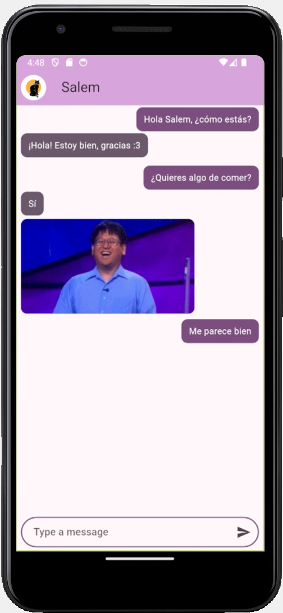

# Yes/No Chat App



Aplicación de chat interactiva desarrollada en Flutter que simula una conversación con un asistente que responde automáticamente con "Sí" o "No" acompañado de GIFs animados cuando se le hace una pregunta.

## 🎯 Características

- **Chat en tiempo real**: Interfaz de mensajes con burbujas diferenciadas para el usuario y las respuestas automáticas
- **Respuestas automáticas**: Detecta preguntas (terminadas en "?") y genera respuestas automáticas consumiendo la API de [yesno.wtf](https://yesno.wtf/api)
- **GIFs animados**: Cada respuesta incluye un GIF aleatorio relacionado con la respuesta
- **Scroll automático**: El chat se desplaza automáticamente al último mensaje
- **Temas personalizables**: Sistema de temas con múltiples opciones de color
- **Manejo de estado global**: Implementación de Provider para gestión eficiente del estado

## 🏗️ Arquitectura del Proyecto

```
lib/
├── main.dart                 # Punto de entrada de la aplicación
├── models/                   # Modelos de datos
│   ├── message.dart         # Modelo de mensaje del chat
│   └── yesno_response.dart  # Modelo de respuesta de la API
├── providers/               # Gestión de estado
│   └── chat_provider.dart   # Provider del chat
├── screens/                 # Pantallas de la aplicación
│   └── chat_screen.dart     # Pantalla principal del chat
├── services/                # Servicios externos
│   ├── api_service.dart     # Cliente HTTP con Dio
│   └── yesno_service.dart   # Servicio para la API Yes/No
├── themes/                  # Temas y estilos
│   └── app_theme.dart       # Configuración de temas
└── widgets/                 # Componentes reutilizables
    ├── message_field_box.dart      # Campo de entrada de mensajes
    ├── my_message_bubble.dart      # Burbuja de mensajes del usuario
    └── your_message_bubble.dart    # Burbuja de respuestas automáticas
```

## 🔧 Tecnologías y Conceptos Implementados

### Gestión de Estado

- **Provider**: Manejo del estado global de la aplicación
- `ChangeNotifier` para notificar cambios en la lista de mensajes
- `Consumer` y `watch` para reconstruir widgets reactivamente

### Consumo de APIs

- **Dio**: Cliente HTTP robusto con configuración de timeouts y headers
- Mapeo automático de respuestas JSON a modelos Dart
- Manejo de errores en peticiones HTTP

### UI/UX

- **Material Design 3**: Uso de `colorSchemeSeed` para temas consistentes
- Widgets personalizados y reutilizables
- Scroll controller para navegación automática
- Focus management en el campo de texto

### Buenas Prácticas

- Separación de responsabilidades (Services, Providers, Widgets)
- Modelos de datos tipados
- Manejo asíncrono con `async/await`
- Validación de entrada de usuario

## 📦 Instalación

### Prerrequisitos

- Flutter SDK (>=3.4.3)
- Dart SDK

### Dependencias

Instala las dependencias necesarias:

```sh
flutter pub add provider
flutter pub add dio
```

O agrega manualmente al `pubspec.yaml`:

```yaml
dependencies:
  provider: ^6.1.2
  dio: ^5.7.0
```

### Ejecutar la aplicación

```sh
flutter pub get
flutter run
```

## 💡 Funcionalidades Técnicas Destacadas

### 1. Auto-respuesta Inteligente

El `ChatProvider` detecta automáticamente si un mensaje termina con "?" y genera una respuesta:

```dart
if (text.endsWith("?")) {
  await generateAnswer();
}
```

### 2. Scroll Automático con Delay

Implementación de scroll suave con verificación de cliente adjunto:

```dart
Future<void> moveScroolToBottom() async {
  await Future.delayed(const Duration(milliseconds: 100));
  if (scrollController.hasClients) {
    scrollController.animateTo(
      scrollController.position.maxScrollExtent,
      duration: const Duration(milliseconds: 300),
      curve: Curves.easeOut,
    );
  }
}
```

### 3. Servicio API Genérico

Cliente HTTP reutilizable con Dio configurado con timeouts y headers:

```dart
ApiService({required String baseUrl})
    : _dio = Dio(BaseOptions(
        baseUrl: baseUrl,
        connectTimeout: const Duration(milliseconds: 5000),
        receiveTimeout: const Duration(milliseconds: 3000),
      ));
```

### 4. Transformación de Datos

Método de conversión de respuesta API a modelo de mensaje:

```dart
Message toMessage() {
  final text = answer == 'yes' ? 'Sí' : 'No';
  return Message(text: text, isMe: false, imageUrl: image);
}
```

## 🎨 Personalización de Temas

El sistema de temas permite seleccionar entre 9 colores predefinidos modificando el índice en `main.dart`:

```dart
theme: AppTheme(selectedColor: 5).theme()
```

Colores disponibles: Custom Purple, Blue, Red, Green, Orange, Purple, Pink, Teal, Amber

## 📚 Aprendizajes Clave

- Implementación de arquitectura limpia en Flutter
- Gestión de estado reactivo con Provider
- Consumo eficiente de APIs REST
- Creación de widgets reutilizables y mantenibles
- Manejo del ciclo de vida de controladores (ScrollController, TextEditingController, FocusNode)
- Operaciones asíncronas y manejo de errores
- UI responsive y adaptable
